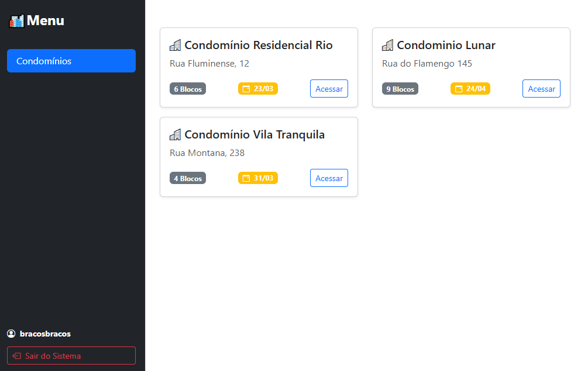
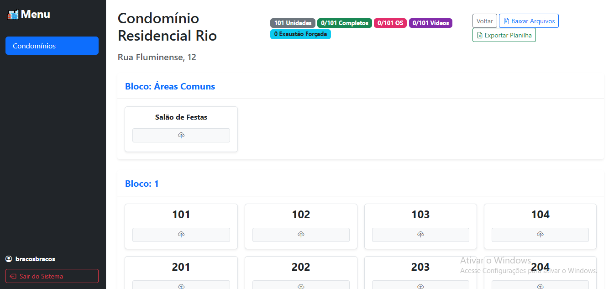
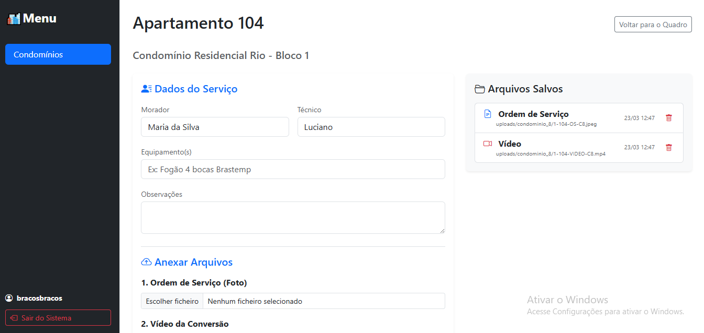

# Estrutura de Condomínio WebApp 🏢


Interface web para prestação de serviços em condomínios. A interface permite que você gere uma estrutura que abre uma entrada para cada apartamento, onde se pode fazer upload de documentos e mídia. Dessa forma a documentação dos serviços prestados a um condomínio fica organizada e padronizada para download e acesso.

É possível ter diferentes pessoas acessando e alimentando a estrutura, com autenticação baseada em permissões. Nesse caso criei esse protótipo para facilitar o serviço de conversão de equipamentos de gás para a empresa em que trabalho.

## 📱 Screenshots

*(Add your screenshots here! Create a `docs/images/` folder in your repo, drop the images in, and update these links.)*

| Dashboard | Structure View | Details |
| :---: | :---: | :---: |
|  |  |  |

## ✨ Key Features

* **Secure User Authentication:** Controlled access ensures that user data and conversion histories remain private and protected within the system.
* **Interactive Data Visualization:** Clean, readable visual representations of the processed data to easily track metrics and conversion outputs.
* **Mobile-Friendly Layout:** A fully responsive HTML/CSS frontend interface that automatically adapts to provide a flawless experience on both desktop monitors and smartphones.
* **Secure Configuration:** strict environment variable management to shield sensitive credentials and database keys from public exposure.

## 💻 Tech Stack

* **Backend Framework:** Django (Python)
* **Frontend:** HTML5, CSS3
* **Security:** `python-dotenv` for environment variable management

## 🗺️ Repository Structure

```plaintext
├── starter/                  # Main Django project and application files
│   ├── manage.py             # Django execution script
│   └── ...                   
├── .env.example              # Template for required environment variables
├── .gitignore                # Security and cache exclusions
├── requirements.txt          # Python dependencies
└── README.md
```

## 🚀 Getting Started
To run this project locally, follow these steps:

## Prerequisites
Python 3.x

## Installation & Setup
```bash
# 1. Clone the repository
git clone [https://github.com/gabrieltrabr/Helper-Conversao.git](https://github.com/gabrieltrabr/Helper-Conversao.git)
cd Helper-Conversao

# 2. Create and activate a virtual environment
python -m venv venv
# On Windows: venv\Scripts\activate
# On Mac/Linux: source venv/bin/activate

# 3. Install dependencies
pip install -r requirements.txt

# 4. Set up Environment Variables
# Create a .env file in the root directory (using .env.example as a guide):
# SECRET_KEY=your_generated_secret_key
# DEBUG=True

# 5. Apply database migrations
cd starter
python manage.py migrate

# 6. Start the local development server
python manage.py runserver
```

### About
(EN-Below)
Atualmente, trabalho em um escritório de instalação e manutenção de gás. A desorganização do ambiente me motivou a criar ferramentas simples para tornar o trabalho mais eficiente. Este projeto ainda será refinado para implementação futura, visto que a empresa descontinuou as tarefas que o aplicativo resolvia.

Decidi compartilhar o código porque acredito que ele possa ser útil: muitos prestadores de serviço que trabalham com manutenção predial precisam de formas práticas de organizar arquivos e ordens de serviço. Com alguns pequenos ajustes, a ferramenta pode ser adaptada para diferentes tipos de atendimento.

I'm currently working in an office that offers services on gas installation and repairs. The office is quite disorganized and it inspires me to create simple tools to make the job more efficient. This will be refined for deployment in the future, since the company discontinued the tasks the app solved.

I found it useful to share, though, because most service workers that deal with buildings need ways to organize their files and work orders, so this might help with a couple of tweaks to make it fit for the service provided.